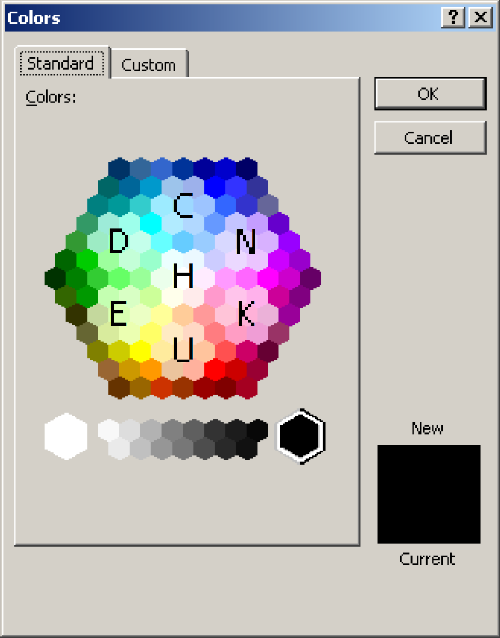

# Bee Engine

This package lets you use Python to load, store, display, and interact with the Spelling Bee puzzles that are posted by the New York Times.

## Usage:

The letters and the words from the 1/16/2022 puzzle will be used as examples, here.

### Basic Information:

```python3
from bee_engine import SpellingBee
async def demo():
    # Basic information
    puzzle = await SpellingBee.fetch_from_nyt()
    print(puzzle.day)                          # "2022-01-16"
    print(puzzle.center)                       # "H"
    print(puzzle.outside)                      # ["U","D","C","E","K","N"]
    print(len(puzzle.answers))                 # 21
    print(len(puzzle.pangrams))                # 2

    # Word checking
    print(puzzle.does_word_count("hunk"))      # True
    print(puzzle.does_word_count("zamboni"))   # False
    print(puzzle.is_pangram("chunked"))        # True
    print(puzzle.is_pangram("hence"))          # False
    print(puzzle.is_pangram("hudcekn"))        # False

    # The guess method returns constants defined by SpellingBee.GuessJudgement
    print(puzzle.guess("hunk"))                # {"accepted word"}
    print(puzzle.guess("chunked"))             # {"accepted word", "pangram"}

    print(puzzle.guess("chunked", {"hunk", "chunked"}))
    # {"accepted word", "already gotten", "pangram"}

    print(puzzle.guess("batarang"))            # {"unaccepted word"}

    print(puzzle.max_points)                   # 127
    print(puzzle.valid_words_to_points(        # 15
        ["hunk", "chunked"]
    ))
    print(puzzle.get_ranking(                  # "Good"
        {"chunked", "hunk"}
    )
```

### Obtaining Hints:

```python3
# The hint table is accessible too, through the SpellingBee.HintTable class:
print(puzzle.get_hints().format_table())
"""\
   4  5  6  7  8  9  Σ
C  -  4  -  3  -  -  7
E  -  -  1  -  -  -  1
H  4  2  1  1  -  -  8
N  -  -  -  1  1  -  2
U  -  -  -  1  1  1  3
Σ  4  6  2  6  2  1  21"""

print(puzzle.get_hints().format_two_letters())
# 'Ch: 7, Eu: 1, He: 4, Hu: 4, Nu: 2, Un: 3'

print(puzzle.get_hints().format_pangram_count())
# 'There are two remaining pangrams.'
```

### The flashy stuff:

```python3
# Just for fun, a list of words that are on Wiktionary and have all the right letters
# but aren't accepted:

print(puzzle.get_wiktionary_alternative_answers())
['unhunched', 'unchunked', 'dechunked', 'dhunchee', 'eunuched', 'chudded', 'dechunk', 'neechee', 'dudheen', 'unhunch', 'cheekee', 'dunched', 'henched', 'deeched', 'cheeked', 'kuchen', 'unheed', 'huchen', 'henned', 'henced', 'hended', 'cheeke', 'cheche', 'hucked', 'unhued', 'eched', 'huced', 'dench', 'cunch', 'ehhed', 'hench', 'khene', 'dunch', 'uhhuh', 'euche', 'hende', 'henne', 'deech', 'kench', 'keech', 'hudud', 'hehe', 'khen', 'huck', 'huhu', 'enuh', 'nuch', 'ehhh', 'hunh', 'hend', 'khud', 'hede', 'eche', 'chek', 'unch', 'ehed', 'uhuh', 'huke', 'chud', 'kueh', 'heuk']

# And for display: there are several available rendering templates.
from bee_engine import BeeRenderer

print(BeeRenderer.get_available_renderer_names())
# ['colorpicker', 'davinci', 'ezersky', 'hexspin', 'honey', 'minecraft', 'pizza', 'rulers', 'telescope', 'worksheet']

async def render_demo():
    with open("example1.png", "wb+") as image_file:
        image = await BeeRenderer.get_renderer("colorpicker").render(puzzle, output_width=500)
        image_file.write(image)
asyncio.run(render_demo())
```

(The following fonts are used by the renderers: Liberation Sans, Kingthings Exeter, fs Tahoma 8px, Minecraft Font by JDGraphics, and Arial. If any of these are not installed on your computer, the renderer will fall back to a default font, and the result will not look as good.)



```python3
async def other_render_demo():
    with open("example2.png", "wb+") as image_file:
        image = await BeeRenderer.get_renderer("rulers").render(puzzle)
        image_file.write(image)
asyncio.run(other_render_demo())
```


```python3
# Currently, only PNGs are rendered, but for future proofing this property exists:
print(BeeRenderer.get_renderer("rulers").output_format) # "png"

# Alternatively, you can store the rendered image in the puzzle object:
async def store_render_test(): await puzzle.render("rulers")
asyncio.run(test())
print(type(puzzle.image))         # <class 'bytes'>
print(puzzle.image_file_type)     # "png"
```

### Basic persistence:

```python3
# You can persist puzzles, including their images, easily:
puzzle.persist_to("mypuzzles.db")
# At any point in the future when that file still exists:
retrieved_puzzle = SpellingBee.retrieve_saved("latest", "mypuzzles.db")
# or if you previously saved the puzzle from this date:
older_puzzle = SpellingBee.retrieve_saved("2022-01-01", "mypuzzles.db")

# If you update the SpellingBee object by rendering a new image after calling
# persist_to, that change will be automatically saved.

# (Spelling Bees in the database are uniquely identified by their "day" property,
# so only one SpellingBee object for a given day can be stored at once.)
```

### Sessions:

```python3
# Words found so far can be stored in a "session"
from bee_engine import SessionBee

session = SessionBee(puzzle)
session.guess("hunched")
print(session.gotten_words)                # {"hunched"}

# SessionBee objects have all the same methods as SpellingBee objects but they
# automatically make use of the gotten_words property when possible:
print(session.percentage_words_gotten())   # 4.761904761904762
print(session.list_gotten_words())         # "hunched."
assert SpellingBee.GuessJudgement.already_gotten in session.guess("hunched")
# see also: get_unguessed_words(), get_unguessed_hints(), respond_to_guesses()

# SessionBee objects are identified by their session_id property, which contains a UUID
# generated by the python uuid module:
print(session.session_id)                # "03b853ec-948c-4197-aec1-61d5a2840994" (for example)

# Storing an ID lets you retrieve a specific session over and over:
session.persist_to("mypuzzles.db")
SessionBee.retrieve_saved("03b853ec-948c-4197-aec1-61d5a2840994", "mypuzzles.db")
# After a persist_to call, all updates to the session will be automatically saved.

# Or you can tell this package to store a specific session's ID as the current 
# "primary" one:
session.make_primary_session()
assert SessionBee.get_primary_session_id("mypuzzles.db") == session.session_id
SessionBee.retrieve_saved("primary", "mypuzzles.db")

# Finally, you can use the "metadata" property to store some arbitrary JSON-serializable
# data that goes along with a session:
session.metadata = {"guesser": "H. G. Wells"}
assert SessionBee.retrieve_saved(
    "primary", "mypuzzles.db"
).metadata["guesser"] == "H. G. Wells"
```

So, those are the main points.
